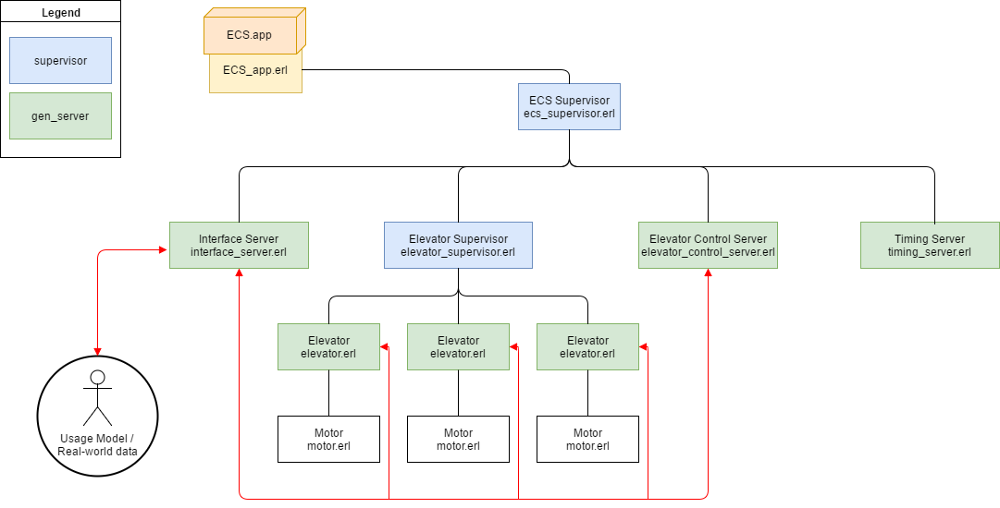

Elevators
=====

Elevator system for dynamic number of elevator and floors. Direct Erlang API as well as built in TCP server using Netstring messages to interact. 

Structure
---------
See diagram Elevators.png (exported from [draw.io](http://draw.io/))


Build
-----

    $ rebar3 compile


Usage
-----

Start Application:
```erlang
application:start(elevators)
```

###### Erlang direct api
Erl: Manage external direction call (a button a pressed on a floor to callthe lift)
```erlang
elevator_control_server:user_call(Floor, Direction)
```
Types:
```
    Floor = integer() % The floor at which button is pressed
    Direction = up|down % direction of button call
```

Erl: Handle/enter floor buttons pressed on the buttons *inside* the lift
```erlang
elevator_control_server:elevator_local_destination(ElevatorNum, FloorNum)
```
Types:
```
    ElevatorNum = FloorNum = integer()
```

###### Netstring client api
Connect to configured port when running. Multiple concurrent connections supported
Send strings as below (encoded subsequently as netstring) for control

NetStr: Manage external direction call
`CALL,{Floor},{Direction},{Status}`
{Floor} = Integer floor
{Direction} = String of "up" or "down"
{Status} = "1" for entry
e.g. "CALL,0,up,1" for Up button pressed on ground floor (floor 0)

NetStr: Handle/enter floor buttons pressed on the buttons *inside* the lift
`INTERNAL_BUTTON,{Elevator},{Floor},{Status}`
{Elevator} = Integer of elevator number
{Floor} = Integer of Floor destination
{Status} = "1" for entry
e.g. "INTERNAL_BUTTON,1,6,1" for button for floor 6 being pressed in lift 1

